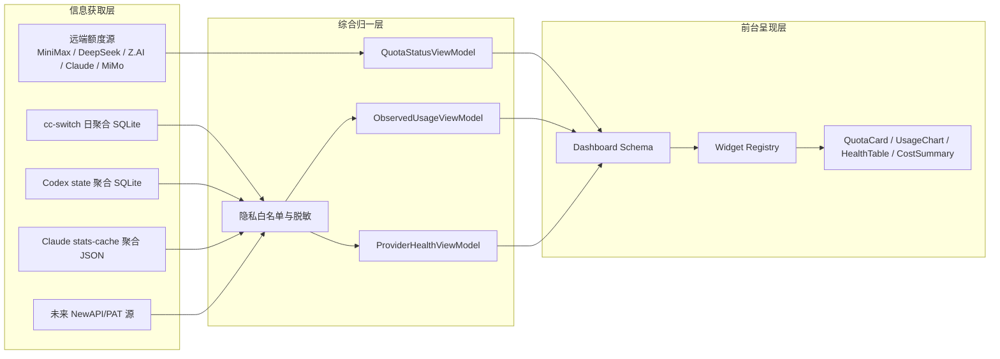

# AgentSense 个人 Agent/API 状态仪表盘改造方案

日期: 2026-06-08

状态: 阶段性设计稿

补充文档:

- `docs/specs/2026-06-08-unified-agent-api-dashboard-model.md`: 统一 Agent/API 数据模型、Source Adapter、Signal/Dataset、Widget Registry 与可编排 Dashboard Layout 的 v0.1 规格。
- `docs/examples/agentsense.sources.example.toml`: 可迁移 source registry 配置样例。
- `docs/examples/dashboard.layout.example.yaml`: 类飞书多维表格仪表盘的布局编排样例。

## 最新意图校准

本项目的主目标已经从“Agent/API 状态仪表盘”进一步校准为:

> 重读轻写、面向展示与态势观察的个人作战仪表盘。

Agent/API 使用和额度是第一阶段主域，因为它最贴近当前痛点，也最容易用 AgentSense 现有能力承接。但系统未来不应被限制为 Agent/API 页面；它需要能扩展到设备状态、系统资源、时间块、任务、工作流和其他个人态势信息。

第一版策略:

1. 先保持当前界面风格，不大改 UI。
2. 先做到“状态一眼懂”，让页面值得常驻看。
3. 先本地优先，接 Claude Code、Codex、CC Switch 等聚合数据。
4. 远端 NewAPI/Sub2API/provider 额度作为“额度管家”能力逐步接入。
5. 本地数据只读聚合，不读正文、标题、preview、token 或 cookie。
6. 迁移只做配置迁移，不同步历史 usage 数据。
7. 写操作只限配置、布局、刷新、显示别名等低风险动作。

## 目标

把 AgentSense 改造成一个本地优先的个人作战仪表盘。第一阶段聚焦 Agent/API 状态与使用情况：它应当能把“我正在使用哪些 Agent、各 API/代理的额度和健康情况、最近实际消耗趋势”汇总到一个常驻页面里。长期来看，它应当成为个人态势观察底座，可以继续接入设备、系统、任务、时间块和其他工作流状态。

核心判断: 这个系统要分成三层，而不是把“获取信息、综合数据、前台展示”揉在一起。

1. 信息获取层: 读取远端额度、本地聚合使用量、本地健康状态。
2. 综合归一层: 把不同来源归一成稳定的 view model，并执行隐私过滤。
3. 前台呈现层: 用轻量的 dashboard runtime 组装结构化 widget。

## 已确认事实

### 仓库与运行

- AgentSense 已克隆到本地 AI 开发目录下的 `agentsense` 子目录。
- 兄弟依赖 wattson 已克隆到同一开发目录下的 `wattson` 子目录。
- 当前默认 feature 包含 `psu`，因此需要 `../wattson`。
- 已验证:
  - `cargo metadata --no-default-features --features pure-rust --format-version 1`
  - `cargo check --no-default-features --features pure-rust`
  - `cargo check`
  - `cargo run --no-default-features --features pure-rust -- --config config.empty-local.toml quota`
  - `serve` 模式下 `/api/all` 和 `/` 可返回 200。

### 当前 AgentSense 结构

后端是 Rust + Axum 单体服务:

- `src/config.rs`: `AppConfig` / `QuotaConfig`
- `src/server/mod.rs`: `AppState`、`router`、`serve`、`do_poll`
- `src/server/handlers/mod.rs`: API handler 与静态文件 handler
- `src/quota/db.rs`: AgentSense 自己的 SQLite 存储
- `src/quota/mod.rs`: CLI/一次性 quota 编排
- `web/index.html`、`web/app.js`、`web/style.css`: 当前静态前端

当前路由已包含:

- `/`
- `/app.js`
- `/style.css`
- `/api/all`
- `/api/quota`
- `/api/history`
- `/api/weekly-history`
- `/api/consumption`
- `/api/deepseek`
- `/api/deepseek/history`
- `/api/deepseek/platform`
- `/api/zai`
- `/api/zai/history`
- `/api/zai/models`
- `/api/mimo`
- `/api/mimo/history`
- `/api/claude`
- `/api/claude/history`
- `/api/config`
- `/api/refresh`

### 已经不是短板的部分

旧文档里规划的多账号能力，当前代码已经大体落地:

- `QuotaConfig` 中 provider 已是 `Vec<...>`。
- `KeyConfig`、`ZaiKeyConfig`、`MimoConfig`、`DeepSeekPlatformConfig` 已有 `label`。
- `AppConfig::migrate_config` 已支持旧 `[quota.xxx]` 到新 `[[quota.xxx]]` 的迁移。
- `/api/all` 已按 provider 返回多账号数组。

所以下一步不应再把主力放在“多账号配置”，而应转向“本地 observed usage 聚合层”和“结构化前端呈现层”。

## 本地安全数据源

### 第一优先级: cc-switch 聚合数据库

路径:

`%USERPROFILE%\.cc-switch\cc-switch.db`

只允许读取这些聚合表/字段:

- `usage_daily_rollups`
  - `date`
  - `app_type`
  - `provider_id`
  - `model`
  - `request_count`
  - `success_count`
  - `input_tokens`
  - `output_tokens`
  - `cache_read_tokens`
  - `cache_creation_tokens`
  - `total_cost_usd`
  - `avg_latency_ms`
- `model_pricing`
- `provider_health`
- `proxy_config` 中非敏感的路由/状态字段

禁止读取:

- `prompts`
- `proxy_request_logs` 中任何请求正文、响应正文、header、Authorization、cookie
- 任何 token、key、cookie 原文

### 第二优先级: Codex 本地状态聚合

路径:

`%USERPROFILE%\.codex\state_5.sqlite`

只允许从 `threads` 表读取聚合字段:

- `created_at`
- `updated_at`
- `created_at_ms`
- `updated_at_ms`
- `model_provider`
- `model`
- `tokens_used`
- `source`
- `sandbox_policy`
- `approval_mode`
- `archived`
- `has_user_event`

禁止展示:

- thread title
- preview
- first user message
- prompt/response 正文
- session/thread 原始内容

### 第三优先级: Claude stats-cache

路径:

`%USERPROFILE%\.claude\stats-cache.json`

只允许读取聚合字段:

- `dailyActivity`
- `dailyModelTokens`
- `modelUsage`
- `totalSessions`
- `totalMessages`
- `hourCounts`
- `totalSpeculationTimeSavedMs`

禁止读取或展示 `.claude` 其他 usage-data 中的总结、目标、摩擦细节、提示词或回复正文。

### 远端额度源

远端额度必须通过用户显式提供的 PAT/OAuth/API token 接入。不能从本地配置、浏览器 profile、cookie 文件或历史日志中“顺手扒 token”。

聊天记录里提到的 `qai.qianc.top/api/status?user=XXXX` 这类无 token 查询目前不应假设存在。应按“需要个人访问令牌”的模型设计。

## 分层架构



## 后端改造方案

### 原则

本地 observed usage 不接入 `do_poll`，也不接入 `QuotaOrchestrator::fetch_all`。

理由:

- 本地聚合源不需要远端轮询。
- 本地聚合源应该按请求只读查询，避免常驻任务误读敏感文件。
- 远端额度与本地实际消耗是两类概念，应保持清晰边界。

### 新增配置

建议在 `QuotaConfig` 下新增:

```toml
[quota.observed_usage]
enabled = true
auto_detect = true

[[quota.observed_usage.sources]]
kind = "cc_switch"
path = "C:\\Users\\<user>\\.cc-switch\\cc-switch.db"

[[quota.observed_usage.sources]]
kind = "codex_state"
path = "C:\\Users\\<user>\\.codex\\state_5.sqlite"

[[quota.observed_usage.sources]]
kind = "claude_stats"
path = "C:\\Users\\<user>\\.claude\\stats-cache.json"
```

实际实现时可以先只做 `cc_switch`，其余两个 source 在第二阶段加入。

### 新增 API

第一阶段新增独立接口:

`GET /api/observed-usage?days=30&source=cc_switch`

返回形态:

```json
{
  "configured": true,
  "source": "cc_switch",
  "status": {
    "state": "ok",
    "message": null,
    "last_read_at": 1780860000000
  },
  "summary": {
    "days": 30,
    "request_count": 123,
    "success_count": 120,
    "input_tokens": 1000,
    "output_tokens": 200,
    "cache_read_tokens": 0,
    "cache_creation_tokens": 0,
    "total_cost_usd": "0.00",
    "avg_latency_ms": 100
  },
  "daily": [],
  "models": []
}
```

可选第二阶段把摘要挂入 `/api/all`:

```json
{
  "observed_usage": {
    "configured": true,
    "sources": ["cc_switch", "codex_state", "claude_stats"],
    "summary": {}
  }
}
```

### 建议文件清单

新增:

- `src/usage/mod.rs`
  - `ObservedUsageConfig`
  - `ObservedUsageSource`
  - `ObservedUsageQuery`
  - `ObservedUsageResponse`
  - `ObservedUsageSummary`
  - `ObservedUsageDay`
  - `ObservedUsageModel`
- `src/usage/cc_switch.rs`
  - `CcSwitchUsageReader::open_readonly`
  - `CcSwitchUsageReader::schema_probe`
  - `CcSwitchUsageReader::query_summary`
- `tests/observed_usage_tests.rs`

修改:

- `src/lib.rs`: 导出 `usage` 模块。
- `src/config.rs`: 增加 observed usage 配置。
- `src/server/mod.rs`: `AppState` 增加 observed usage 配置，router 注册 `/api/observed-usage`。
- `src/server/handlers/mod.rs`: 新增 `api_observed_usage`。
- `config.example.toml`: 增加占位示例，不写真实本机路径。

### 错误策略

- 未启用: `200 { "configured": false }`
- 路径不存在: `200`，`status.state = "missing"`
- schema 不匹配: `200`，`status.state = "schema_mismatch"`
- SQLite 查询失败: 对内映射为 `AgentSenseError::Database`，对外只返回简短错误码。
- `/api/all` 不应因为 observed usage 源失败而整体失败。

## 前端技术选型

### 结论

第一阶段保留当前 vanilla 静态承载，但把 `web/app.js` 改造成轻量 dashboard runtime:

- 数据源注册
- dashboard schema
- widget registry
- 统一状态/错误态
- 图表封装

这比直接上 Refine、Grafana、Superset、BI 低代码框架更适合当前 AgentSense。

### 方案对比

| 方案 | 优点 | 缺点 | 判断 |
|------|------|------|------|
| 保留 vanilla + 自研 widget registry | 最贴合当前单 binary；无 Node 构建链；范围可控 | 类型约束弱；需要自己维护生命周期 | 推荐第一阶段 |
| React/Vite + shadcn/ui + TanStack Query/Table | 组件边界清晰；状态和表格体验好；后续扩展舒服 | 引入 Node 构建链；Rust 静态嵌入要改发布流程 | 第二阶段候选 |
| React + react-grid-layout | 响应式、可拖拽、可调整大小；适合 React 仪表盘 | React-only；第一阶段会被迫迁移前端 | 未来布局引擎候选 |
| Refine 类 admin 框架 | CRUD、资源、权限、多页面后台强 | 对个人 Agent/API 状态过大，容易变后台平台 | 暂不采用 |
| Grafana/Superset/BI 类 | 报表、查询、看板能力强 | 目标漂移明显；需要数据建模/权限/部署 | 不采用 |
| GridStack.js 类 vanilla grid | 可拖拽；不强制 React | 若第一阶段就做自由布局，会扩大范围 | 只作为后续可选增强 |

### Dashboard runtime 形态

建议 `web/app.js` 先拆出这些逻辑区域，仍可在单文件内渐进进行:

```javascript
const DATA_SOURCES = {
  all: () => apiGet('/api/all'),
  observedUsage: (params) => apiGet('/api/observed-usage', params),
};

const WIDGETS = {
  quotaCard: renderQuotaCard,
  usageChart: renderUsageChart,
  healthTable: renderHealthTable,
  costSummary: renderCostSummary,
  modelTable: renderModelTable,
};

const DASHBOARD_SCHEMA = {
  sections: [
    {
      id: 'overview',
      widgets: [
        { type: 'quotaCard', source: 'all', provider: 'minimax' },
        { type: 'costSummary', source: 'observedUsage' }
      ]
    }
  ]
};
```

第一阶段不做用户自由拖拽和可视化编辑器，只做固定 schema。这样既能结构化组装，又能防止范围扩大。

## 实施切片

### 第 0 片: 基线确认

状态: 已完成。

- 克隆仓库。
- 克隆 wattson 依赖。
- 初始化 CodeGraph。
- 用空本地 config 跑通 `quota` 与 `serve`。
- 更新 `.gitignore` 忽略本地配置、SQLite、CodeGraph、运行日志。

### 第 1 片: cc-switch observed usage 后端

目标: 增加只读 `/api/observed-usage`，只支持 cc-switch。

验收:

- 缺失路径不崩溃。
- schema 不匹配不崩溃。
- 只读打开 SQLite。
- 返回 JSON 不包含敏感字段名。
- `cargo test observed_usage` 通过。
- `cargo check --no-default-features --features pure-rust` 通过。

### 第 2 片: Codex 与 Claude 聚合源

目标: 在同一 `/api/observed-usage` 下加入 `codex_state` 与 `claude_stats`。

验收:

- Codex 只读取 threads 白名单字段。
- Claude 只读取 stats-cache 聚合字段。
- 不展示标题、preview、prompt、response、summary 正文。

### 第 3 片: 前端 dashboard runtime

目标: 不改视觉风格，先改结构。

验收:

- `web/app.js` 有明确的数据层、schema、widget registry。
- 现有 MiniMax/DeepSeek/Z.AI/Claude/MiMo/PSU 显示不回退。
- 新增 observed usage 摘要、趋势、模型/提供商表格。
- 空数据、未配置、stale、error 都有清晰状态。

### 第 4 片: 可选 React/Vite 迁移评估

触发条件:

- `web/app.js` 继续膨胀到难以维护。
- widget 超过 12 个。
- 需要复杂表格、筛选、保存布局、交互状态共享。

届时再迁移到 React/Vite + shadcn/ui + TanStack Query/Table；如果需要可拖拽布局，再评估 react-grid-layout。

## 测试计划

### Rust 单元/集成测试

- `tests/observed_usage_tests.rs`
  - cc-switch schema probe 成功。
  - 缺表返回 schema mismatch。
  - 空库返回空 summary。
  - days 参数过滤正确。
  - 只读连接不会写入。
  - JSON 中不包含 `token`、`cookie`、`authorization`、`prompt`、`response`、`preview`。

### API 测试

- 复用 `tests/api_integration_tests.rs` 的 `router(state)` 模式。
- 测 `/api/observed-usage` 未配置、配置但缺路径、配置并有 fixture 三种情况。

### 前端验证

- 本地 `serve` 启动。
- 浏览器打开 `/`。
- 验证现有卡片仍显示。
- 验证 observed usage widget 的空态、正常态、错误态。
- 移动端与桌面端截图确认无重叠。

## 隐私与安全规则

1. 不自动发现或读取任何 token/cookie 原文。
2. 不读取 `.codex` 或 `.claude` 会话正文。
3. 不读取浏览器 Cookies/Login Data/Local Storage。
4. 不在日志中打印 token、cookie、Authorization、完整请求 header。
5. 不在文档中写入个人真实使用明细。
6. 对外 API 只返回白名单字段。
7. 远端账户额度必须由用户显式配置 PAT/OAuth。

## 下一步建议

先做第 1 片: cc-switch observed usage 后端。

它的投入最小、收益最高，也最符合 AgentSense 当前结构。做完后，前端即便还没重构，也能先把本地实际使用量展示出来；同时它会为 Codex/Claude 聚合源和 dashboard runtime 提供稳定数据契约。
