# 个人作战仪表盘统一模型与可编排呈现 v0.1

日期: 2026-06-08

状态: 第一版规格草案 + demo 实践记录

适用仓库: AgentSense 魔改分支 `dev-improve-2026-06-08`

## 产品意图校准

本项目的核心不是“写一套新前端”，也不是“做一个通用低代码/BI 平台”，而是把 AgentSense 改造成一个**重读轻写、面向展示与态势观察的个人作战仪表盘**。

第一阶段的主域是 Agent/API 使用与额度状态，但这不是系统边界。统一模型必须允许日后扩展到设备状态、系统资源、工作流、时间块、任务态势、知识库健康等其他个人作战信息。

意图定义:

> 在保持当前 AgentSense 界面风格的基础上，持续汇总“我当前依赖的工具、API、模型、设备和工作流是否健康、用了多少、哪里异常、下一步需要注意什么”，让它成为常驻可看的个人态势台。

设计原则:

1. **重读轻写**: 默认只读取和归一化状态；写操作只限配置、布局、手动刷新、本地标记等低风险动作。
2. **展示优先**: 第一版以“状态一眼懂”为验收标准，不以复杂编辑器、完整账本或自动化控制为目标。
3. **Agent/API 先行，但模型不锁死**: Agent/API 是首个最有价值的领域；模型层要能容纳未来其他个人态势来源。
4. **保持现有风格**: 第一版不大改 UI，不追求炫技式视觉重做，优先保证现有风格一致与信息密度提升。
5. **配置可迁移，历史不迁移**: 同步 layout/source 配置和 secret 引用，不同步历史 usage 数据。
6. **隐私默认收紧**: 本地 Claude Code/Codex 数据第一版只读聚合字段，不读正文、标题、preview 或会话内容。

## 一句话结论

AgentSense 的下一步不应继续堆 provider 专属卡片，而应升级为一个可扩展的个人态势观察系统:

```text
Source Adapter -> Unified Signal/Dataset Model -> Widget Registry -> Dashboard Layout
```

卡片不直接绑定 Claude Code、Codex、NewAPI、Sub2API、CC Switch 或某个电源软件。卡片绑定统一语义数据；不同来源只负责给这些语义槽位供数。

例如“电量”不应写死为某个台式机电源软件的卡片，而应是 `device.power.battery.percent` 或 `device.power.status`。笔记本可以接 Windows 系统 API，台式机可以接专用监控软件，UPS 也可以作为另一个来源填同一类指标。

## 当前进展意味着什么

当前阶段已经证明五件关键事实:

1. AgentSense 可以在本机跑起来，原有 Rust + Axum + 静态前端结构可继续复用。
2. 本地真实 usage 可以被接入页面，至少 `.claude.json` 中的 Claude Code 聚合字段已经能安全白名单读取。
3. 原项目的 provider quota 模型可用但不够通用；它适合展示“某个 provider 的额度”，不适合承载“个人 Agent/API 使用控制台”。
4. Codex、CC Switch、NewAPI、Sub2API 可以进入同一个模型消耗视图，模型排序不应默认按来源分块。
5. 趋势图必须按量纲拆分，美元成本、Token 数量、额度/余额不能混在同一个坐标轴里。

这意味着我们可以基于 AgentSense 魔改，而不是重写一套系统。但必须新增一个统一模型层，否则前端会继续变成一堆硬编码卡片。

更重要的是: Agent/API 只是第一批高价值来源，不应把系统命名、模型、组件和配置锁死在“API quota”这个单一问题上。

## 2026-06-08 Demo 实践结果

当前 demo 通过 `local-usage-proxy.mjs` 暂时承接统一模型层，提供 `/api/command-demo` 给静态前端使用。这个实现是过渡层，但已经验证了正式模型 API 需要保留的字段语义。

已验证 source:

| Source | 当前状态 | 主要产出 | 安全边界 |
|--------|----------|----------|----------|
| `claude-code-local` | 已接入 | 项目聚合成本、模型 token、工作区排行 | 只读 `.claude.json` 聚合字段 |
| `codex-local` | 已接入 | Codex 模型/provider token 聚合 | 只读 `state_5.sqlite` 白名单字段，不读 preview/title/message |
| `cc-switch` | 已接入 | 模型请求、tokens、成本、近 7 天模型趋势 | 聚合读取，不展示 prompt/response/header |
| `newapi-main` | 已接入 | 用户额度、请求统计、模型聚合 | 显式 token + user id，不提交凭据 |
| `sub2api-main` | 已接入 | key 级余额、今日/累计 usage、模型统计 | 显式 API key，不提交凭据 |

当前前端已经落地的统一视角:

- “模型消耗 Top”按模型名聚合多来源数据，默认成本优先，可切换 Token、请求、来源分组。
- “模型消耗分布”使用统一多源模型数据，不再只看 Claude Code。
- “模型 Token / 成本趋势”使用上下分区图，Token 与 USD 成本分别使用独立 y 轴空间。
- “采样趋势”拆成量纲分组: 本地 Agent 成本/USD、Token 消耗分开呈现。
- “中转专区趋势”把 NewAPI 与 Sub2API 各自做成独立趋势图，避免额度、余额、成本、Token 混在同一张小图里。

这些结论应反向约束正式 widget registry: widget 可以共享容器与交互，但不得把不同单位的数据强行合并到一个趋势坐标轴。

## 目标

### 产品定位

第一版产品定位为:

- 个人作战仪表盘，而不是单一 API quota 工具。
- 重读轻写的态势观察系统，而不是自动化控制台。
- 当前 UI 风格下的信息结构增强，而不是视觉重做。
- 可配置、可迁移、可扩展的展示底座，而不是完整低代码平台。

### 必须做到

- 统一 Agent/API 使用、额度、余额、健康、趋势、设备状态等信息的表达方式。
- 以 Agent/API 为第一阶段主域，同时允许未来接入 device/system/workflow/custom 等非 Agent/API 领域。
- 支持本地 Claude Code、Codex、CC Switch、NewAPI、Sub2API 作为第一批重要来源。
- 支持远端 provider，如 MiniMax、OpenAI、DeepSeek、Claude、QAI 等，通过显式 token/PAT 接入。
- 支持像飞书多维表格仪表盘那样按模块组装页面，但范围只限结构化呈现，不做完整低代码平台。
- 支持配置迁移到其他电脑，secret 不进入可同步配置文件。
- 支持特殊自定义组件，但普通指标、表格、图表尽量复用通用 widget。
- 第一版保持现有界面风格一致，不做大规模 UI 重构。

### 暂不做到

- 不做通用 BI 查询器。
- 不做可视化拖拽编辑器的第一版。
- 不做自动化执行/控制中心，不主动替用户调用高风险操作。
- 不读取 prompt、response、thread title、preview、cookie、Authorization、浏览器 profile。
- 不自动“扒”本地已有 token；所有远端访问凭据必须由用户显式配置。
- 不把 NewAPI/Sub2API 某个部署的接口形态写死为唯一标准。
- 不同步历史 usage 数据到其他电脑；第一版只迁移配置和引用。

## 总体架构

```mermaid
flowchart LR
    subgraph sources["数据来源"]
        claudeLocal["Claude Code local"]
        codexLocal["Codex local"]
        ccSwitch["CC Switch"]
        newapi["NewAPI / Sub2API"]
        providers["MiniMax / OpenAI / QAI / DeepSeek"]
        systemApi["System API / Battery / Disk"]
        workflow["Timeblock / Task / Workflow"]
        customScript["Custom Script"]
    end

    subgraph adapters["Source Adapter 层"]
        detect["发现与配置"]
        collect["采集"]
        normalize["归一化"]
        privacy["白名单与脱敏"]
    end

    subgraph model["统一模型层"]
        sourceStatus["SourceStatus"]
        entities["Entity / Subject"]
        signals["Signal"]
        datasets["Dataset"]
        rollups["Rollup"]
    end

    subgraph api["后端 API"]
        apiSources["/api/sources"]
        apiSignals["/api/signals"]
        apiDatasets["/api/datasets/:id"]
        apiDashboard["/api/dashboards/:id"]
    end

    subgraph ui["前端呈现"]
        registry["Widget Registry"]
        layout["Dashboard Layout"]
        widgets["Metric / Ring / Table / Chart / Custom"]
    end

    sources --> detect --> collect --> normalize --> privacy --> model
    model --> api
    api --> registry --> layout --> widgets
```



## 读写边界

这个系统默认是观察型系统，不是控制型系统。

允许的轻写:

- 保存 dashboard layout。
- 保存 source registry。
- 保存用户为工作区、来源、模型设置的显示别名。
- 手动触发刷新。
- 记录本地非敏感状态，如“已读告警”“隐藏此卡片”。

默认禁止:

- 自动修改远端账户、API key、余额、渠道或订阅。
- 自动写入 Claude/Codex 会话数据。
- 自动清理历史、删除 key、关闭服务、切换路由。
- 在没有明确确认的情况下执行任何会改变外部系统状态的动作。

后续如果需要写操作，必须单独进入“操作/控制”能力设计，并与“态势观察”明确分层。

## 统一数据模型

### SourceDefinition

SourceDefinition 描述一个数据来源。它回答“从哪里拿数据、如何认证、多久刷新、能产出什么”。

```ts
type SourceDefinition = {
  id: string
  kind:
    | "claude_code_local"
    | "codex_local"
    | "cc_switch"
    | "newapi"
    | "sub2api"
    | "provider_api"
    | "system_api"
    | "workflow_local"
    | "custom_script"
  label: string
  enabled: boolean
  scope: "local" | "remote" | "hybrid"
  refresh: {
    mode: "on_request" | "interval" | "manual"
    intervalSeconds?: number
  }
  auth?: {
    type: "none" | "bearer" | "pat" | "oauth" | "custom_header" | "auto"
    secretRef?: string
    headerName?: string
  }
  path?: string
  baseUrl?: string
  capabilities: SourceCapability[]
}
```

第一版允许 `secretRef` 指向环境变量，例如 `env:NEWAPI_TOKEN`。后续可以接 Windows Credential Manager 或本地加密 secret store。

### SourceStatus

所有来源必须返回统一状态，前端才能稳定展示“可用/缺失/认证失败/过期”。

```ts
type SourceStatus = {
  sourceId: string
  state:
    | "ok"
    | "disabled"
    | "missing"
    | "auth_failed"
    | "unavailable"
    | "schema_mismatch"
    | "stale"
    | "rate_limited"
    | "error"
  message?: string
  lastReadAt?: string
  nextRefreshAt?: string
  latencyMs?: number
}
```

约定:

- `missing`: 本地文件、数据库或系统能力不存在。
- `schema_mismatch`: 本地库存在但版本结构不符合白名单查询。
- `auth_failed`: token/PAT/OAuth 无效。
- `unavailable`: 网络或服务不可达。
- `stale`: 上一次成功数据过旧，但仍可展示。

### Entity / Subject

Entity 表示“被观察对象”。Signal 和 Dataset 都应挂到 Entity 上，避免一切都靠字符串标题。

```ts
type Entity = {
  id: string
  kind:
    | "agent_app"
    | "api_provider"
    | "api_account"
    | "api_key"
    | "model"
    | "project"
    | "workspace"
    | "device"
    | "system"
  label: string
  sourceId?: string
  parentId?: string
  tags?: string[]
}
```

示例:

- `agent_app:claude-code`
- `agent_app:codex`
- `api_provider:newapi-main`
- `model:claude-sonnet-4`
- `project:workspace-hash-xxx`
- `device:laptop-primary`

### Signal

Signal 是最小统一指标。指标卡、状态卡、环形图、告警条都优先消费 Signal。

```ts
type Signal = {
  id: string
  path: string
  domain: "agent" | "api" | "device" | "system" | "workflow" | "custom"
  kind:
    | "usage"
    | "quota"
    | "balance"
    | "health"
    | "limit"
    | "trend"
    | "event"
    | "inventory"
  subjectId: string
  value: number | string | boolean | object | null
  unit?: "token" | "usd" | "request" | "percent" | "minute" | "ms" | "count"
  window?: "now" | "today" | "24h" | "7d" | "30d" | "billing_cycle"
  sourceId: string
  confidence: "observed" | "reported" | "estimated" | "derived"
  freshness: {
    observedAt?: string
    collectedAt: string
    staleAfterSeconds?: number
  }
  quality?: {
    partial?: boolean
    missingFields?: string[]
    warning?: string
  }
}
```

`confidence` 语义:

- `observed`: 本地实际记录，如 CC Switch、Claude Code、Codex state。
- `reported`: 远端接口直接报告，如 NewAPI 余额、provider quota。
- `estimated`: 由 token 和价格估算出来的成本。
- `derived`: 由多个 signal 聚合出来的二级指标。

### Dataset

Dataset 面向表格、趋势图、分布图。它是结构化行数据，不等同于任意 JSON dump。

```ts
type Dataset = {
  id: string
  title: string
  sourceIds: string[]
  grain: "raw_row" | "hour" | "day" | "week" | "month" | "entity"
  columns: DatasetColumn[]
  rows: Record<string, unknown>[]
  privacy: {
    containsSensitiveText: false
    sanitized: true
  }
  freshness: {
    collectedAt: string
    staleAfterSeconds?: number
  }
}

type DatasetColumn = {
  key: string
  label: string
  type: "string" | "number" | "currency" | "percent" | "datetime" | "status"
  unit?: string
}
```

第一批 Dataset:

- `agent.usage.by_day`
- `agent.usage.by_model`
- `agent.usage.by_project`
- `api.providers.health`
- `api.keys.status`
- `api.quota.by_account`
- `device.power.sources`
- `workflow.timeblocks.by_day`
- `workflow.tasks.status`

## Signal 命名规范

Signal `path` 使用语义路径，不使用 UI 文案。

推荐命名:

```text
agent.usage.cost.today
agent.usage.cost.7d
agent.usage.tokens.input.today
agent.usage.tokens.output.today
agent.usage.tokens.cache.7d
agent.usage.requests.today
agent.usage.models.top.7d
agent.usage.projects.top.7d

api.balance.usd.remaining
api.quota.tokens.remaining
api.quota.requests.remaining
api.quota.reset_at
api.keys.active.count
api.keys.error.count
api.providers.health
api.providers.latency.p95

device.power.battery.percent
device.power.ac.connected
device.power.ups.percent
system.disk.free.percent
system.memory.used.percent

workflow.timeblocks.active
workflow.timeblocks.today.count
workflow.tasks.open.count
workflow.tasks.blocked.count
```

规则:

1. Widget 默认绑定语义路径，不绑定 provider 私有字段。
2. provider 差异通过 `sourceId`、`subjectId`、`tags` 和 adapter 处理。
3. 如果某个来源无法提供指标，返回缺失状态，不伪造 0。
4. 金额统一用 USD 保存，前端可以另做本地显示换算。
5. 时间窗口必须显式标注，避免把 today、7d、billing cycle 混在一起。

## 第一批 Source Adapter

### Claude Code local

来源:

- `.claude.json`
- `.claude/stats-cache.json`

允许:

- 项目级聚合成本
- 模型级 token 聚合
- daily/hourly 聚合
- session/message 计数

禁止:

- prompt
- response
- thread title
- conversation summary
- 任何 token/cookie

主要产出:

- `agent.usage.cost.today`
- `agent.usage.cost.7d`
- `agent.usage.by_model`
- `agent.usage.by_project`

### Codex local

来源:

- `.codex/state_5.sqlite`
- 后续可选 `.codex/logs_2.sqlite` 的非正文聚合

允许:

- model_provider
- model
- tokens_used
- source
- sandbox_policy
- approval_mode
- archived
- created/updated timestamps

禁止:

- preview
- title
- first user message
- rollout JSONL 正文

主要产出:

- Codex 近期活动
- Codex token 使用
- Codex 模型分布
- Codex 会话健康状态

### CC Switch

来源:

- `.cc-switch/cc-switch.db`

优先读取:

- `usage_daily_rollups`
- `model_pricing`
- `provider_health`
- 非敏感 proxy config 状态

主要产出:

- 跨工具 usage rollup
- provider 健康
- 模型成本估算
- 请求成功率与延迟

### NewAPI / Sub2API

来源:

- 用户显式配置的 `baseUrl`
- 用户显式配置的 PAT / token / 自定义 header

第一版不假设某个无 token URL 一定存在。不同部署可以通过 adapter 配置声明端点:

- status endpoint
- quota endpoint
- token usage endpoint
- key list endpoint
- channel health endpoint

2026-06-08 实测补充:

- NewAPI 默认 React 前端通过 cookie 登录态访问 `/api/user/self`、`/api/token/`、`/api/log/self` 等用户面板接口。
- “个人资料”里的系统访问令牌用于用户面板接口，源码路径是 `middleware.UserAuth()`；请求头通常是 `Authorization: <access_token>`，源码也会兼容去掉 `Bearer ` 前缀。
- 系统访问令牌路径还必须带 `New-Api-User: <user_id>`。这个值是 NewAPI 前端从本地 `uid` 传给后端的用户 ID；没有该头会在令牌有效时仍返回 401。
- API Key 令牌用于 OpenAI 兼容接口、`/api/usage/token/`、`/api/log/token`、`/dashboard/billing/*`，通常是 `Authorization: Bearer sk-...`。
- Adapter 第一版应使用 `auth.type = "auto"` 自动探测 user access token 与 API key 两类路径；系统访问令牌需要 `user_id_ref`，鉴权失败返回 `SourceStatus.state = "auth_failed"`，不得让页面崩溃。
- 站点公开 `/api/status` 只能证明实例可达，不能代表用户额度可读。

Sub2API 2026-06-08 实测补充:

- Sub2API 当前按模型 API Key 维度计数，没有发现 NewAPI 式用户级 PAT。
- key 级查询接口为 `GET /v1/usage`，鉴权为 `Authorization: Bearer <API Key>`。
- 返回结构包含 `isValid`、`mode`、`balance` / `remaining`、`usage.today`、`usage.total`、`model_stats` 等聚合字段。
- AgentSense 第一版把 Sub2API 建模为 `api_key` scope 的远端数据源，展示 key 是否有效、余额、今日请求/token/成本、累计请求/token/成本、模型排行。
- 真实 key 只允许放在环境变量或 `.agentsense.local.env` 这类本地 ignore 文件里，提交物只记录 `secret_ref`。

主要产出:

- `api.balance.usd.remaining`
- `api.quota.tokens.remaining`
- `api.keys.active.count`
- `api.keys.error.count`
- `api.providers.health`
- `api.providers.latency.p95`
- `api.quota.by_account`

### System API / device power

来源:

- Windows battery API
- WMI / PowerShell fallback
- 台式机专用监控软件
- UPS 或自定义脚本

主要产出:

- `device.power.battery.percent`
- `device.power.ac.connected`
- `device.power.status`
- `device.power.ups.percent`

这个 adapter 说明“电量”本质上是统一指标，不是某个旧 AgentSense PSU 卡片。

### Workflow / timeblock local

来源:

- ExoMind RT / eventlog
- 本地任务或时间块数据源
- 后续可选其他工作流状态源

第一版不作为主接入目标，但统一模型要给它留位置。

主要产出:

- `workflow.timeblocks.active`
- `workflow.timeblocks.today.count`
- `workflow.tasks.open.count`
- `workflow.tasks.blocked.count`

这类来源说明本系统未来不止呈现 Agent/API 用量，也可以承载个人工作流态势。

## 后端 API 草案

### `GET /api/sources`

返回来源注册表与状态。

```json
{
  "sources": [
    {
      "id": "claude-code-local",
      "kind": "claude_code_local",
      "label": "Claude Code 本地",
      "enabled": true,
      "status": { "state": "ok", "lastReadAt": "2026-06-08T06:20:00+08:00" },
      "capabilities": ["agent_usage", "model_usage", "project_usage"]
    }
  ]
}
```

### `GET /api/signals`

按 domain、path、source、subject、window 查询 Signal。

```text
/api/signals?domain=agent&window=7d
/api/signals?path=api.providers.health
/api/signals?source=newapi-main
```

返回:

```json
{
  "signals": [],
  "generatedAt": "2026-06-08T06:20:00+08:00"
}
```

### `GET /api/datasets/:id`

返回结构化数据集。

```text
/api/datasets/agent.usage.by_model?window=7d
/api/datasets/api.quota.by_account
```

### `GET /api/dashboards/:id`

返回 dashboard layout 加上必要的 bootstrap 数据。第一版也可以前端直接读取静态 YAML/JSON。

### 兼容路线

保留当前 `/api/all`，不立刻破坏现有页面。新模型先并行提供 `/api/sources`、`/api/signals`、`/api/datasets`。等 Widget Registry 完成后，再逐步让旧卡片走新模型。

## Widget Registry

Widget 只关心“需要什么数据”和“如何展示”，不关心数据从哪个文件或哪个 API 来。

第一批 widget:

| 类型 | 用途 | 绑定对象 |
|------|------|----------|
| `metric-card` | 单个关键指标 | `Signal` |
| `quota-ring` | 百分比或余量 | `Signal` + optional limit |
| `status-grid` | 多来源健康矩阵 | `Dataset` 或 Signal group |
| `trend-chart` | 时间趋势 | `Dataset` |
| `stacked-bar` | 模型/来源分布 | `Dataset` |
| `entity-table` | 项目、模型、key、账号表格 | `Dataset` |
| `alert-strip` | 异常提醒 | Signal group |
| `custom-component` | 特殊领域展示 | 自定义组件 + typed props |

布局上先支持固定 grid 配置，不做可视化拖拽。配置中保留 `x/y/w/h`，以后可以升级为拖拽布局。

### 趋势 Widget 量纲规则

趋势图应先按数据单位分组，再考虑来源和模型。当前 demo 的分组规则应成为正式 widget registry 的默认约束:

| 量纲 | 推荐 widget | 可混排对象 | 不应混排对象 |
|------|-------------|------------|--------------|
| USD / CNY 成本 | `trend-chart` 或上下分区 trend | 本地成本、Sub2API 今日成本、累计成本 | Token、请求数、百分比 |
| Token | `trend-chart` | 本地 Token、Sub2API 今日 Token、模型 Token 趋势 | 美元成本、余额 |
| 请求数 | `trend-chart` / `bar-chart` | 请求、成功请求、错误请求 | Token、余额 |
| 额度 / 余额 | provider 专区趋势 | NewAPI 可用/已用额度、Sub2API 余额 | 模型 token、模型成本排行 |
| 百分比 | `quota-ring` / `trend-chart` | 使用率、健康率、电量百分比 | 货币、Token 原始量 |

展示策略:

1. 模型维度可以统一混排，但 tooltip 必须展示来源列表和已知/未知成本状态。
2. 趋势维度优先分量纲；需要同屏比较时使用上下分区、双图或小 multiples，不使用单轴硬塞。
3. 中转类来源可以有自己的专区趋势图，重点看额度、余额、有效性和 key 级 usage。
4. 成本未知时显示 `--`，不把未知成本渲染成 `$0.00`。

## Dashboard Layout 草案

```yaml
version: 1
dashboards:
  - id: overview
    title: 总览
    grid:
      columns: 12
      rowHeight: 72
    sections:
      - id: top
        title: 今日状态
        widgets:
          - id: cost-today
            type: metric-card
            title: 今日 Agent 成本
            bind:
              kind: signal
              path: agent.usage.cost.today
            layout: { x: 0, y: 0, w: 3, h: 2 }

          - id: provider-health
            type: status-grid
            title: API 健康
            bind:
              kind: dataset
              id: api.providers.health
            layout: { x: 3, y: 0, w: 6, h: 2 }

          - id: battery
            type: quota-ring
            title: 电量
            bind:
              kind: signal
              path: device.power.battery.percent
            fallback:
              state: missing
              message: 当前设备未提供电池数据
            layout: { x: 9, y: 0, w: 3, h: 2 }
```

## 配置迁移方案

### 可同步配置

这些文件可以进 Git 或同步盘:

- `agentsense.sources.toml`
- `dashboard.layout.yaml`
- `dashboard.widgets.yaml`

其中只能保存:

- source id
- source kind
- base URL
- 本机路径模板
- secret 引用名
- dashboard layout
- widget 编排

### 不可同步内容

这些必须留在本机:

- token
- cookie
- OAuth refresh token
- PAT 原文
- Authorization header
- 完整个人路径和 session id
- 原始 prompt/response

### 路径模板

配置允许使用:

```text
${HOME}
${USERPROFILE}
${AGENTSENSE_PROFILE}
```

例如:

```toml
path = "${USERPROFILE}\\.codex\\state_5.sqlite"
```

不同电脑只需换 profile 或环境变量，不改 dashboard layout。

## 实施切片

### 第 0 片: 规格与样例

状态: 已完成并经过 demo 反向校准。

交付:

- 统一数据模型 v0.1
- Source Adapter 边界
- Signal 命名规范
- Widget Registry 第一版
- dashboard layout 样例
- sources 配置样例

### 第 1 片: 后端模型骨架

状态: demo proxy 已验证契约，Rust 正式模块待实现。

目标:

- 新增 `src/dashboard` 或 `src/model` 模块。
- 定义 `SourceDefinition`、`SourceStatus`、`Signal`、`Dataset` 的 Rust 类型。
- 新增只返回 mock/derived 数据的 `/api/sources`、`/api/signals`。
- 不迁移前端，不破坏 `/api/all`。
- 明确读写边界: 第一版 API 只暴露只读查询和低风险配置读取。

验收:

- `cargo check --no-default-features --features pure-rust`
- JSON 不包含敏感字段名。
- 未配置 source 返回 `disabled` 或 `missing`，不 panic。

### 第 2 片: 本地 Adapter

状态: demo proxy 已接入 Claude Code、Codex、CC Switch 聚合源；Rust 正式 adapter 待实现。

目标:

- `claude_code_local`
- `codex_local`
- `cc_switch`

验收:

- 只读打开本地文件/SQLite。
- 缺路径和 schema mismatch 都返回状态，不中断页面。
- 只输出白名单字段。

### 第 3 片: NewAPI / Sub2API Adapter

状态: demo proxy 已接入 NewAPI 与 Sub2API，凭据留在本地 ignored 配置；Rust 正式 adapter 待实现。

目标:

- 支持 base URL + token/PAT。
- 支持端点映射配置。
- 把余额、额度、key 状态、渠道健康转成统一 Signal/Dataset。

验收:

- token 只从 secretRef 解析，不进入前端。
- 请求失败有 `SourceStatus`。
- 支持多个 NewAPI/Sub2API 实例。

### 第 4 片: 前端 Dashboard Runtime

状态: 已完成过渡版。当前仍是 vanilla + ECharts，但已经有统一模型排行、模型趋势、量纲拆分趋势和中转专区趋势。

目标:

- 前端按 dashboard layout 渲染。
- 引入 widget registry。
- 旧卡片逐步转为 widget。
- 暂不做拖拽编辑器。

验收:

- 总览页能展示 Agent 使用、API 健康、余额/额度、设备状态。
- 未配置来源显示清楚空态。
- 旧 `/api/all` provider 信息不回退。

### 第 5 片: 布局编辑与 React 评估

触发条件:

- widget 超过 12 个。
- 需要保存布局。
- 表格、筛选、联动明显复杂。

届时再评估 React/Vite、TanStack Query/Table、react-grid-layout。第一版不急着迁移。

## 第一版优先级

| 事项 | Impact | Confidence | Ease | 判断 |
|------|--------|------------|------|------|
| 统一数据模型文档与样例 | 9 | 9 | 9 | 立即做 |
| `/api/sources` 与 `/api/signals` 类型骨架 | 8 | 8 | 7 | 下一步固化 |
| Claude/Codex/CC Switch 本地 adapter | 9 | 8 | 5 | demo 已验证，高优先固化 |
| NewAPI/Sub2API adapter | 8 | 8 | 5 | demo 已验证，高优先固化 |
| 前端 widget registry | 9 | 8 | 6 | 过渡版已验证，继续模块化 |
| workflow/timeblock 预留模型 | 6 | 8 | 8 | 文档预留，暂缓实现 |
| 拖拽布局编辑器 | 5 | 6 | 3 | 暂缓 |
| React/Vite 迁移 | 6 | 7 | 4 | 条件触发 |

## 决策记录

1. 先保留 AgentSense 的 Rust 单服务和静态前端，不立刻迁移 React。
2. 先并行新增统一模型 API，不直接删除旧 `/api/all`。
3. Dashboard 先用配置文件编排，不做可视化编辑器。
4. NewAPI/Sub2API 用显式 token/PAT + 可配置端点，不假设无 token 查询。
5. 所有本地 Agent 数据必须白名单读取，正文类内容不进入模型。
6. Agent/API 是第一阶段主域，不是长期模型边界。
7. 第一版是重读轻写的态势观察系统，不是自动化控制台。

## 下一步

建议下一步做“demo 契约固化”:

1. 从 `/api/command-demo` 中抽出正式的 SourceStatus、Signal、Dataset Rust 类型。
2. 增加 `/api/sources`、`/api/signals`、`/api/datasets/:id`，先返回当前 demo 已验证的数据。
3. 把 `local-usage-proxy.mjs` 中 NewAPI/Sub2API 的解析逻辑迁入正式 adapter，保留 Node 代理作为开发辅助。
4. 前端把当前硬编码 dashboard 区块逐步收敛到 widget registry，先做只读固定 layout，不做拖拽编辑器。
5. 增加模型/来源/Top N 趋势筛选，并把 NewAPI/Sub2API 的日粒度聚合纳入模型趋势大图。
